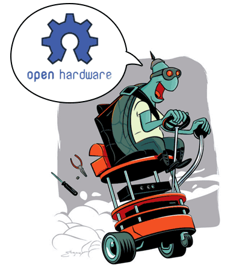

  

    
  

  

    <ul>
      <li><a href="{{ site.baseurl }}/qna">
Q&amp;A
</a></li>
      <li><a href="{{ site.baseurl }}/learn">
Learn
</a></li>
      <li><a href="{{ site.baseurl }}/opensource">
Open Source
</a></li>
      <li><a href="{{ site.baseurl }}/partners">
Partners
</a></li>
    </ul>
  

 

  

    <h1 id="what-is-a-turtlebot">What is a TurtleBot?</h1>
    
TurtleBot is a low-cost, personal robot kit with open-source software. TurtleBot was created at Willow Garage by Melonee Wise and Tully Foote in November 2010. With TurtleBot, you’ll be able to build a robot that can drive around your house, see in 3D, and have enough horsepower to create exciting applications.

    
For more information, we recommend an interview with TurtleBot creators, Tully Foote and Melonee Wise.
    <a href="http://spectrum.ieee.org/automaton/robotics/diy/interview-turtlebot-inventors-tell-us-everything-about-the-robot">TurtleBot Inventors Tell Us Everything About the Robot</a> (IEEE Spectrum, By Evan Ackerman, 26 Mar 2013)

    
<iframe width="560" height="315" src="https://www.youtube.com/embed/9OC3J53RUsk?ecver=1" frameborder="0" allowfullscreen></iframe>

  

  

    
  

# TurtleBot Family

  

 

# TurtleBot Distributors

TurtleBot3 Distributor : RED (), TurtleBot2 Manufacturer/Distributor : BLUE ()

If you want to be added to the map, please visit <a href="{{ site.baseurl }}/partners">here</a> for partner registration.

 

# TurtleBot Collaboration

## TurtleBot3

  

## TurtleBot2

